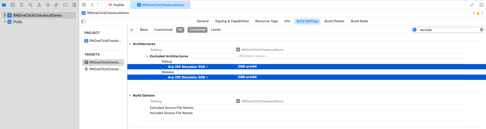
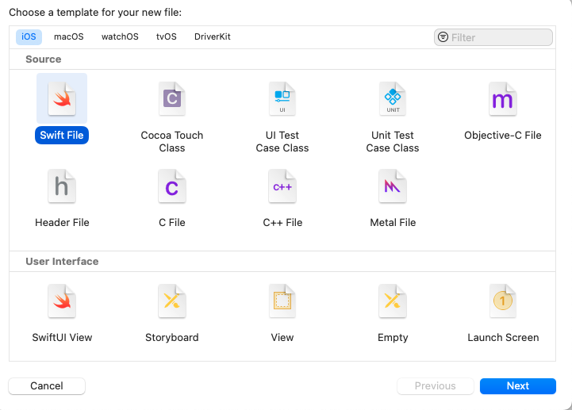
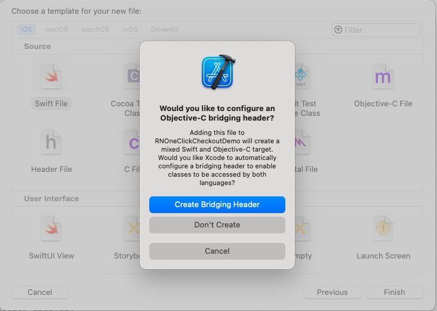
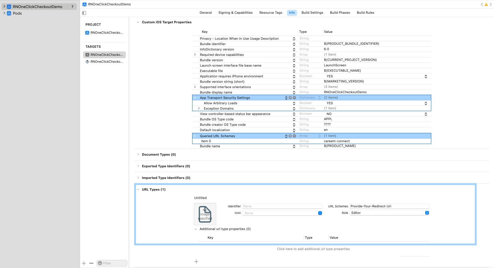

# RNOneClickCheckoutDemo
This is a React Native demo project that explain how to use OneClickCheckout SDK in react native App.

# Getting Started

>**Note**: Make sure you have completed the [React Native - Environment Setup](https://reactnative.dev/docs/environment-setup) instructions till "Creating a new application" step, before proceeding.

## Start your Application

Let Metro Bundler run in its _own_ terminal. Open a _new_ terminal from the _root_ of your React Native project. Run the following command to start your _iOS_ app:


### For iOS
**Minimum iOS Deployment Target:** 13.0

```bash
# using npm
npm install

# OR using Yarn
yarn install

# install pod dependencies
cd ios/

# then run
bundle install && bundle exec pod install

# then go back to previous directory
cd ..

# using npm
npm start
npm run ios

# OR using Yarn
yarn start
yarn ios
```

If everything is set up _correctly_, you should see demo app running in your _iOS Simulator_ 

This is one way to run your app — you can also run it directly from within Xcode.

## Integerating SDK with your App

Let's modify your app to integrate the OneClickCheckout SDK into it.
1. Open Your project in Xcode.
2. Add `OneClickCheckout` and `Analytika` frameworks in the Podfile. Ensure you are using version `1.2.0` or a newer version of `OneClickCheckout` for React Native apps. You can find all available versions [here](https://careempublic.jfrog.io/ui/native/careem-cocopod-local/OneClickCheckout-iOS). Additionally, exclude the `arm64` architecture for simulators and add it in the `post_install` section of the Podfile.

```bash title="Podfile"
# .......

pod 'Analytika', :http => 'https://careempublic.jfrog.io/artifactory/careem-maven-local/com/careem/analytika/analytika-ios-universal-framework/0.57.0/analytika-ios-universal-framework-0.57.0.zip'

pod 'OneClickCheckout', :http => "https://careempublic.jfrog.io/artifactory/careem-cocopod-local/OneClickCheckout-iOS/1.2.0/OneClickCheckout.zip"

# .......

# Exclude `arm64` architecture for simulators.
post_install do |installer|
  # ....... other script
  
  installer.pods_project.targets.each do |target|
    target.build_configurations.each do |config|
      # Disable arm64 builds for the simulator
      config.build_settings['EXCLUDED_ARCHS[sdk=iphonesimulator*]'] = 'arm64'
    end
  end
  
  # ....... other script
end
```
3. Exclude `arm64` for `Any iOS Simulator SDK` from the project target. You can do this by navigating to `YourProject -> Target -> Build Settings -> Excluded Architecture`, as shown in the image.

4. Install pod dependencies
```bash
# install pod dependencis
cd ios/

# then run
pod install
```
5. To use the OneClickCheckout SDK, let's add the necessary wrappers and bridging:

   - Open your project in Xcode.
   
   - Add a Swift file with the name **`OneClickButtonWrapper.swift`**.
   
   - If you don't already have a **'YourProjectName-Bridging-Header.h'** file, you may be asked, **`Would you like to configure an Objective-C bridging header?`**. In that case, click on **`Create Bridging Header.`**
   
   - Create **`OneClickEventEmitter.h`** and **`OneClickEventEmitter.m`**.
   
   - Create a bridge for React Native with the name **`OneClickButtonWrapperBridge.m.`**
   
   - Replace the code in each class with the provided code below.



### OneClickButtonWrapper.swift
```swift
// OneClickButtonWrapper.swift
import React
import OneClickCheckout

@objc(OneClickButtonWrapper)
class OneClickButtonWrapper: RCTViewManager {
  // Reference to the OneClickButtonView instance
  private var buttonView: OneClickButtonView?
  
  private var cb: ((Result<String, Error>) -> Void)?
  
  private var customEventEmitter: OneClickEventEmitter? {
    let bridge = RCTBridge.current()
    let eventEmitter = bridge?.module(for: OneClickEventEmitter.self) as? OneClickEventEmitter
    return eventEmitter
  }
  
  override func view() -> UIView! {
    buttonView = OneClickButtonView()
    return buttonView
  }
  
  // Expose a method to configure the button from JavaScript
  @objc func handleFetchInvoiceResult(_ invoiceId: String) {
    self.cb?(.success(invoiceId))
  }
  
  @objc func configure(
    _ clientId: String,
    redirectUri: String,
    buttonStyle: NSDictionary,
    environment: String
  ) {
    guard let buttonView = buttonView else { return }
    
    let rootViewController = RCTPresentedViewController()
    guard let currentViewController = rootViewController ?? (UIApplication.shared.connectedScenes.first as? UIWindowScene)?.windows.first?.rootViewController else {
      return
    }
    
    // Convert buttonStyle NSDictionary to a Swift struct
    //    let style = CareemButtonStyle(dictionary: buttonStyle)
    let style = CareemButtonStyle(dict: buttonStyle)
    
    // Convert environment string to the corresponding enum value
    guard let environmentEnum = Environment(rawValue: environment) else {
      return
    }
    
    // Create a callback function for fetchInvoiceCallback
    let fetchInvoiceCallbackBlock: (@escaping (Result<String, Error>) -> Void) -> Void = { [weak self] resultCallback in
      guard let self else { return }
      // Perform the necessary operations and invoke the resultCallback
      // with the appropriate Result value
      // ...
      self.cb = resultCallback
      self.customEventEmitter?.sendFetchInvoiceCallbackEvent()
    }
    
    // Create a callback function for onComplete
    let onCompleteBlock: (TransactionStatus) -> Void = { [weak self] transactionStatus in
      guard let self else { return }
      self.sendOnCompleteCallbackEvent(status: transactionStatus)
    }
    
    DispatchQueue.main.async {
      buttonView.configure(
        viewController: currentViewController,
        clientId: clientId,
        redirectUri: redirectUri,
        buttonStyle: style,
        environment: environmentEnum,
        fetchInvoiceCallback: fetchInvoiceCallbackBlock,
        onComplete: onCompleteBlock
      )
    }
  }
  
  func sendOnCompleteCallbackEvent(status: TransactionStatus) {
    let eventData: [String: Any] = [
      "status": status.value,
    ]
    customEventEmitter?.send(onCompleteCallbackEvent: eventData)
  }
  
  // Register the module with React Native
  override static func moduleName() -> String! {
    return "OneClickButtonWrapper"
  }
  
  // Optionally, export any methods or constants required by your module
  override static func requiresMainQueueSetup() -> Bool {
    return true
  }
  
  @objc static func resumeAuthorizationFlow(url: NSURL) {
    // Implementation of your static function
    if let url = url as URL? {
      AuthenticateHandler.sharedInstance.resumeAuthorizationFlow(url: url)
    }
  }
}
```

### YourProjectName-Bridging-Header.h
```objective-c
// YourProjectName-Bridging-Header.h

#import "React/RCTBridgeModule.h"

// required only for UI Views
#import "React/RCTViewManager.h"
// required only for Event Emitters
#import "React/RCTEventEmitter.h"
// required for calling methods on ViewManagers
#import "React/RCTUIManager.h"

#import "OneClickEventEmitter.h" // Import the CustomEventEmitter header
```

### OneClickEventEmitter.h
```objective-c
// OneClickEventEmitter.h

#import <React/RCTEventEmitter.h>

@interface OneClickEventEmitter : RCTEventEmitter

- (void)sendFetchInvoiceCallbackEvent;
- (void)sendOnCompleteCallbackEvent: (NSDictionary *) body;

@end
```

### OneClickEventEmitter.m
```objective-c
// OneClickEventEmitter.m

#import "OneClickEventEmitter.h"

@implementation OneClickEventEmitter

RCT_EXPORT_MODULE();

- (NSArray<NSString *> *)supportedEvents {
  return @[@"OnCompleteCallback", @"OnFetchInvoiceCallback"];
}

- (void)startObserving {
  // Required override, but no implementation needed here
}

- (void)stopObserving {
  // Required override, but no implementation needed here
}

- (void)sendOnCompleteCallbackEvent: (NSDictionary *) body {
  [self sendEventWithName:@"OnCompleteCallback" body:body];
}

- (void)sendFetchInvoiceCallbackEvent {
  [self sendEventWithName:@"OnFetchInvoiceCallback" body:nil];
}

@end
```

### OneClickButtonWrapperBridge.m
```objective-c
// OneClickButtonWrapperBridge.m

#import "YourProjectName-Swift.h" // Import the Swift header replace YourProjectName with the name of your project.
#import <React/RCTViewManager.h>

@interface OneClickButtonWrapperBridge : RCTViewManager

@property (nonatomic, strong) OneClickButtonWrapper *buttonWrapper;

@end

@implementation OneClickButtonWrapperBridge

RCT_EXPORT_MODULE(OneClickButtonWrapper)

- (UIView *)view
{
  self.buttonWrapper = [[OneClickButtonWrapper alloc] init];
  return self.buttonWrapper.view;
}

RCT_EXPORT_METHOD(configureWithRef:(NSString *)clientId
                  redirectUri:(NSString *)redirectUri
                  buttonStyle:(NSDictionary *)buttonStyle
                  environment:(NSString *)environment) {
  dispatch_async(dispatch_get_main_queue(), ^{
    // Retrieve the UIView instance using the provided viewRef
    if (self.buttonWrapper) {
      [self.buttonWrapper configure:clientId
                                    redirectUri:redirectUri
                                    buttonStyle:buttonStyle
                                    environment:environment];
    } else {
      NSLog(@"Error: buttonWrapper instance not found.");
    }
  });
}

RCT_EXPORT_METHOD(handleFetchInvoiceResult:(NSString *)invoiceId) {
  dispatch_async(dispatch_get_main_queue(), ^{
    // Retrieve the UIView instance using the provided viewRef
    if (self.buttonWrapper) {
      [self.buttonWrapper handleFetchInvoiceResult:invoiceId];
    } else {
      NSLog(@"Error: buttonWrapper instance not found.");
    }
  });
}

@end
```

6. In `AppDelegate.mm` add following code.
### AppDelegate.mm
```objective-c
// AppDelegate.mm
#import "YourProjectName-Swift.h" // Import the Swift header replace YourProjectName with the name of your project.
// ....
- (BOOL)application:(UIApplication *)app openURL:(NSURL *)url options:(NSDictionary<UIApplicationOpenURLOptionsKey,id> *)options {
  [OneClickButtonWrapper resumeAuthorizationFlowWithUrl:url];
  return  true;
}

```
7. Add `careem-connect` as an `LSApplicationQueriesSchemes` and `redirectUri` as a `URL scheme` in your `info.plist`. Additionally, include `Allow Arbitrary Loads` in the `App Transport Security Settings`, as shown in the image.

8. Now, we need to create a `.js` wrapper on the React Native side that will utilize native code. Create a file named `OneClickButtonWrapperComponent.ios.js` on the React Native side, and copy the following code. The height of the button container is fixed at 88 points.

### OneClickButtonWrapperComponent.ios.js
```javascript
import React, { useRef, useEffect } from 'react';
import { StyleSheet } from 'react-native';
import { requireNativeComponent, NativeEventEmitter, NativeModules } from 'react-native';

const { OneClickButtonWrapper, OneClickEventEmitter } = NativeModules;

const OneClickButtonView = requireNativeComponent('OneClickButtonWrapper');

const OneClickButtonWrapperComponent = ({
  clientId,
  redirectUri,
  buttonStyle,
  environment,
  fetchInvoiceCallback,
  onComplete,
  ...props
}) => {

  const configureButton = () => {    
    OneClickButtonWrapper.configureWithRef(
      clientId,
      redirectUri,
      buttonStyle,
      environment
    );
  };

  const handleFetchInvoiceCallback = async () => {
    console.log("handle fetchInvoiceCallback --");
  
    try {
      const invoiceId = await fetchInvoiceCallback();
      if (invoiceId) {
        handleFetchInvoiceResult(invoiceId);
      } else {
        // Handle the case where the API response is empty or an error occurred.
        console.error("Unable to fetch invoice ID.");
      }
    } catch (error) {
      // Handle any errors that occur during the API call.
      console.error("API call error:", error);
      handleFetchInvoiceResult('');
    }
  };

  const handleFetchInvoiceResult = (invoiceId) => {
    // Logic for handling fetch invoice
    OneClickButtonWrapper.handleFetchInvoiceResult(invoiceId)
  };
  const eventEmitterRef = useRef(null);

  const handleOnCompleteCallback = (event) => {
    const { status } = event;
    console.log('OnCompleteCallback status :', status);
    onComplete(status)
  };


  useEffect(() => {
    eventEmitterRef.current = new NativeEventEmitter(OneClickEventEmitter);

    eventEmitterRef.current.addListener('OnCompleteCallback', handleOnCompleteCallback);
    eventEmitterRef.current.addListener('OnFetchInvoiceCallback', handleFetchInvoiceCallback);

    configureButton(); // Invoke configureButton when the component is mounted
    return () => {
        eventEmitterRef.current.removeListener('OnCompleteCallback', handleOnCompleteCallback);
        eventEmitterRef.current.removeListener('OnFetchInvoiceCallback', handleFetchInvoiceCallback);
    };
  }, []);

  return (
    <OneClickButtonView
      style={styles.buttonContainer}
      {...props}
    />
  );
};

const styles = StyleSheet.create({
  buttonContainer: {
    height: 88,
    width: '95%', // Set the container width to the screen width
    justifyContent: 'center',
    alignItems: 'center',
  },
});

export default OneClickButtonWrapperComponent;
```
For now android still under development thats why we will add dummy screen for that
### OneClickButtonWrapperComponent.android.js
```javascript
import React from 'react';
import { StyleSheet, View, Text } from 'react-native';

const OneClickButtonWrapperComponent = ({
  clientId,
  redirectUri,
  buttonStyle,
  environment,
  fetchInvoiceCallback,
  onComplete,
  ...props
}) => {

  return (
    <View style={styles.buttonContainer}>
      <Text style={styles.comingSoonText}>Coming Soon</Text>
    </View>
  );  
};

const styles = StyleSheet.create({
  buttonContainer: {
    height: 88,
    width: '95%', // Set the container width to the screen width
    justifyContent: 'center',
    alignItems: 'center',
    backgroundColor: 'black'
  },
  comingSoonText: {
    // Style your text as needed
    color: 'white',
    fontSize: 16,
    fontWeight: 'bold',
  },
});

export default OneClickButtonWrapperComponent;
```
9. To initialize the SDK correctly, you need to configure the button with the following parameters:

- **clientId:** The client ID of the merchant (issued as part of the onboarding process by Careem).
- **redirectUri:** The redirect URI, for example, `com.your.app://careemcallback`. This URI should invoke your app when called by Careem.
- **buttonStyle (optional):** This parameter provides functionality to update the button's style. If not provided, it defaults to the following values:
  - Style: `midnightBlue`
  - Button Description: `dark`
  - Corner Radius: `28`
  - Available options for style: `green`, `white`, `midnightBlue`
  - Available options for button description: `dark`, `light`
- **environment:** The environment should be set to either **`staging`** or **`production`**.
- **fetchInvoiceCallback:** The `fetchInvoiceCallback` is triggered when the user taps the 'One-Click Checkout' button. The merchant is responsible for generating an invoice and returning it within this function.
- **onComplete:** The `onComplete` callback is called at the end of the transaction with one of the following statuses: `success`, `alreadyPaid`, `failed`, `cancelled`, or `invalidInvoiceId`.
### How you use OneClickButtonWrapperComponent
```javascript
let OneClickButtonWrapperComponent;
if (Platform.OS === 'ios') {
    OneClickButtonWrapperComponent = require('./OneClickButtonWrapperComponent.ios.js').default;
} else {
    OneClickButtonWrapperComponent = require('./OneClickButtonWrapperComponent.android.js').default;
}
{/* Other components */}

<OneClickButtonWrapperComponent
    clientId="Merchant Mobile Client Id" // Provice your mobile client id
    redirectUri="Provide-Your-Redirect-Uri://careemcallback" // provide redirectUri
    buttonStyle={{   // button style optional default values are ( midnightBlue, dark, 28.0)
      style: 'midnightBlue',  // background color of button, has three options: midnightBlue / green / white
      buttonDescription: 'dark', // text color of the description that is underneath the button, has two options: dark / light
      cornerRadius: 28.0 // Corner radius of the button 
      }}
    environment="staging" // Environment: staging / production 
    fetchInvoiceCallback={fetchInvoiceIdFromAPI} // Pass the function as a prop that return invoice id 
    onComplete={handleComplete} // Pass the handleComplete function as a prop that will receive final status of payment has 5 options: success / alreadyPaid / failed / cancelled / invalidInvoiceId 
  />

{/* Other components */}
const handleComplete = (status: string) => {
    // Logic for handling completion
    console.log("handle complete "+status)
};

const fetchInvoiceIdFromAPI = async () => {
    return "Return Invoice Id"
}
{/* Other components */}
```

## Congratulations! :tada:
[Demo](screenshots/demo.mp4)
You've successfully integerated OneClickCheckout SDK in your React Native App. :partying_face:
